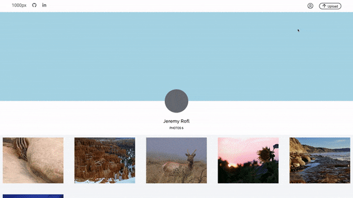
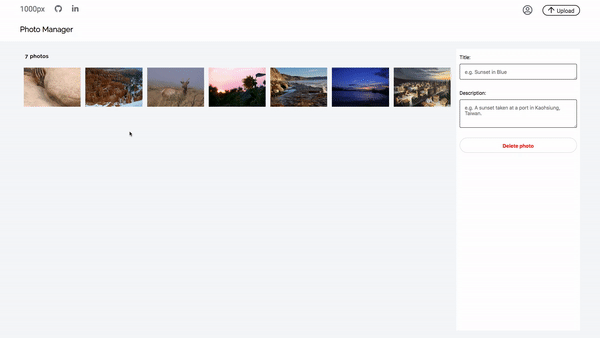
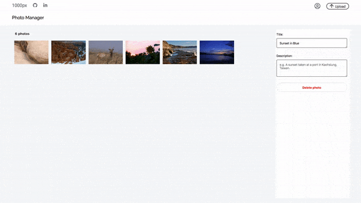

# [1000px](https://asd-1000pix.herokuapp.com/)

### [Live Link](https://asd-1000pix.herokuapp.com/)


1000px is a pixel-perfect tribute to the photography site, 500px. Users can post and share images, as well as look at the profiles of other users as well.

## Table of Contents

  - [Technology Stack](#Technology-Stack)
  - [How to Use](#How-to-Use)
  - [Features](#Features)
    * [Viewing All Photos](#Viewing-All-Photos)
    * [Photo Show Page](#Photo-Show-Page)
    * [Create Photos](#Create-Photos)
    * [Update or Delete Photos](#Update-or-Delete-Photos)
    * [User Profile Page](#User-Profile-Page)
  - [Future Features](#Future-Features)

## Technology Stack

  1000px is a full-stack single-page app created with a Ruby on Rails backend with a PostgreSQL database. The single-page app dynamically renders content via React.js with Redux. Additionally, JBuilder was used to create API responses to help maintain a flat state, and AWS S3 cloud storage was used to store images remotely.

## How to Use

  To use 1000px, you can interact with the [live site](https://asd-1000pix.herokuapp.com/) hosted on Heroku. 
  
  You can also download this repository and set up and run the dependencies via `npm init && npm install && npm start`. You will need to connect AWS S3 to work with ActiveRecord.

## Features

### Viewing All Photos

  Upon successful login, the user is redirected to the index page where every image is rendered.

  

  Hovering over a photograph reveals information about the photographer and image, and clicking on an image takes you to that photo's show page.

  The index page is comprised of two main components; the index page itself, and each individual photograph is it's own component. The individual photo component is reused throughout other pages, such as the user profile page and the photo manager page.

<details>
  <summary>Overall Index Page</summary>

  The index page renders every image. As soon as the component mounts, we dispatch a request to fetch each photo, and update our state to contain the photos.

```js
  componentDidMount(){
    this.props.fetchPhotos()
      .then( () => this.setState({
        photos: this.props.photos
      })
      )
  }
```

<details>
<summary>  
  Click here to see additional details on how `fetchPhotos()` works:
</summary>

  To encapsulate the code, the `fetchPhotos` used here is defined within [photo_actions.js](). 

```js
export const fetchPhotos = () => dispatch => ( 
  APIUtil.fetchPhotos()
    .then(photos => (dispatch(receivePhotos(photos))
      ), err => (
        dispatch(receiveErrors(err.responseJSON))
    ))
);
```   

  Within our photo actions, we use `thunk middleware` to intercept our AJAX call (encapsulated as `APIUtil.fetchPhotos()`), and send the results of our query to the `photos reducer`, which helps maintain our slice of state.

Our `APIUtil.fetchPhotos` is a simple `GET` request:

```js
export const fetchPhotos = () => (
  $.ajax({
    method: 'get',
    url: `/api/photos`,
  })
); 
```

</details>

  Once we have our photos, we map through the array of photos, and thread the photo URL and title as props to each component, `IndvPhoto` (Individual Photo).

```js
<div className="index_page_page">
  {this.state.photos.map((photo, idx) => (
    <Link to={`/photo/${photo.id}`} key={`link_photo_${idx}`} style={{ height: "fit-content" }} >
      <IndvPhoto
        title={photo.title}
        url={photo.fileUrl}
        key={`photo_${idx}`}
      />
    </Link>
  ))
  }
</div>
```

  By wrapping each photo within a `Link` tag, clicking on each image will redirect a user to that photo's show page.

</details>

<details>
  <summary>Individual Photos</summary>

  Because we thread in the url from the index page, we do not need to fetch the photo from the database again. We deconstruct our props object as follows:

```js
  let {title, url, height, editMode, chosen} = this.props;
```

  The `height` and `chosen` props were not threaded when we were on the main index page, but they are used when we are on the 'Photo Manager' page where we can choose a picture to update.

  We then define the object nonHover to encapsulate our inline styling for each individual photograph

```js
let nonHover = {
  backgroundImage: `url(${url})`,
  backgroundSize: 'cover',
  // height: '250px',
  width: 'auto',
}
```
  I used to define a fixed height per image, but I realized I would need a different default height, I wrote the following conditional to assign the height if it is provided as a prop:

```js
if (height) { // if we pass in a height prop
  nonHover.height = height;
} else {
  nonHover.height= "250px";
}
```

  I use inline styling to immediately define the size of each image and prevent content on the page from reshuffling as images load.

  Each photo is a `div` with the class name `indvPhoto`.

```js
<div className="indvPhoto" style={nonHover}>
  <div className="i_p_gradient">
    <div className="top">
      {/* <h1>Placeholder Top</h1> */}
    </div>
    <div className="bottom">
      <h4>{title}</h4>
    </div>
  </div>
  {/*  */}
</div>
```

  By having the image be a div, we can nest in additional `divs`. In this case, there is a container for information to display on hover; if a mouse hovers over the nested gradient, the shadows along with the photo's title will appear.

</details>

### Photo Show Page

  The Photo Show Page includes a larger images accompanied by a description if the photographer wrote one.

  

  Clicking on the photographer's name will redirect you to that photographer's profile page.

  <details>
    <summary>Click here for technical details</summary>

  We reach each photo-show page by assinging the URL in each `<Link>` to be the photo's ID. Therefore, to fetch the corresponding photo, we just need to extract the id from the URL parameters:

```js
  this.props.fetchPhoto(this.props.match.params.photoId) // see app.jsx
```

  Additionally, I link each photo to the user show page via:

```js
  <span>by <Link to={`/users/${photo_usr_id}`} className="photoLink" key={`usr_${photo_usr_id}`}>{photographer}</Link></span>
```

  What's interesting is that the `photographer` key was defined via `jBuilder` and a model-level method.  To maintain a simpler slice of state and minimize information I fetch with each photograph, I wrote a model method to return the photographer's name as a single string, and assign the value in jBuilder.

<details>
  <summary style="color: blue" >Model Methods</summary>

```rb
# Association to User:
belongs_to :user,
  foreign_key: :user_id,
  class_name: :User 
# Method to use above association to return a name
def photographer
  "#{user.first_name} #{user.last_name}"
end
```

</details>

jBuilder Photo Partial:
```rb
  json.set! :photographer, photo.photographer
```

  The jBuilder association minimizes sending information to the frontend because I no longer need to fetch the user with each photo. I did not store the photographer's with each photograph to minimize duplicating names within the database.

</details>


  </details>
  <details>
    <summary> </summary>
  </details>

### User Profile Page

  On the user profile page, the user can view all of their photos they've posted. Eventually, the user profile page will let a user have their own profile picture and 'cover' photo.

### Create photos

  Users can create new photos via the `upload button` in the top of the nav bar. 

  

  I constrain the accepted file format on the frontend before it reaches the server, and render the errors dynamically.

  Upon successfully attaching an image, the user is redirected to the Photo Manager where the user can update or delete photographs.

### Update or Delete photos

  In the Photo Manager, users can only access their own individual photos. They select a photograph by clicking on it, where they can then update the title, descriptionm or even undo their changes. 

  | Update Title | Update Description | Undo Update |
|--------------|--------------------|-------------|
|  |  |  |


  Users can also delete their photographs as well.

  


## Future Features

  * Users can create, read, update, and delete photos
  * Each image can be viewed in a larger frame
  * Infinite scroll for the home feed 
  * Each photo updates the number of views it has.
  * Hovering over a photo reveals more information about it
  * Tracking data with each photo and displaying summary statistics

## Additional Details


