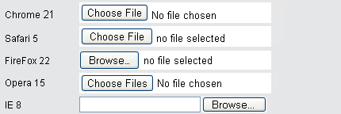
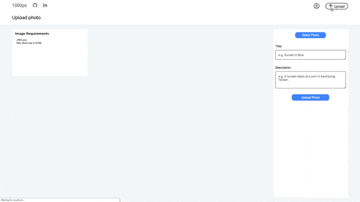

# [1000px](https://asd-1000pix.herokuapp.com/)

### [Live Link](https://asd-1000pix.herokuapp.com/)


1000px is a pixel-perfect tribute to the photography site, 500px. Users can post and share images, as well as look at the profiles of other users as well.

## Table of Contents

  - [Technology Stack](#Technology-Stack)
  - [How to Use](#How-to-Use)
  - [Features](#Features)
    * [Viewing All Photos](#Viewing-All-Photos)
    * [Photo Show Page](#Photo-Show-Page)
    * [Create Photos](#Create-Photos)
    * [Update or Delete Photos](#Update-or-Delete-Photos)
    * [User Profile Page](#User-Profile-Page)
  - [Future Features](#Future-Features)

## Technology Stack

  1000px is a full-stack single-page app created with a Ruby on Rails backend with a PostgreSQL database. The single-page app dynamically renders content via React.js with Redux. Additionally, JBuilder was used to create API responses to help maintain a flat state, and AWS S3 cloud storage was used to store images remotely.

## How to Use

  To use 1000px, you can interact with the [live site](https://asd-1000pix.herokuapp.com/) hosted on Heroku. 
  
  You can also download this repository and set up and run the dependencies via `npm init && npm install && npm start`. You will need to connect AWS S3 to work with ActiveRecord.

## Main Features

### Viewing All Photos

  Upon successful login, the user is redirected to the index page where every image is rendered.

  

  Hovering over a photograph reveals information about the photographer and image, and clicking on an image takes you to that photo's show page.

  The index page is comprised of two components; 
  
  1. The index page itself
  2. The individual photo components; each individual photograph is it's own component. 
  
  The individual photo component is reused throughout other pages, such as the user profile page and the photo manager page.

<details>
  <summary>Click here to learn about the Index Page component</summary>

  The index page renders every image. As soon as the component mounts, we dispatch a request to fetch each photo, and update our state to contain the photos.

```js
  componentDidMount(){
    this.props.fetchPhotos()
      .then( () => this.setState({
        photos: this.props.photos
      })
      )
  }
```

  This component serves to hold individual photo components.

<details>
<summary>

Click here to see additional details on how `fetchPhotos()` works:

</summary>

  To encapsulate the code, the `fetchPhotos` used here is defined within [photo_actions.js](). 

```js
export const fetchPhotos = () => dispatch => ( 
  APIUtil.fetchPhotos()
    .then(photos => (dispatch(receivePhotos(photos))
      ), err => (
        dispatch(receiveErrors(err.responseJSON))
    ))
);
```   

  Within our photo actions, we use `thunk middleware` to intercept our AJAX call (encapsulated as `APIUtil.fetchPhotos()`), and send the results of our query to the `photos reducer`, which helps maintain our slice of state.

Our `APIUtil.fetchPhotos` is a simple `GET` request:

```js
export const fetchPhotos = () => (
  $.ajax({
    method: 'get',
    url: `/api/photos`,
  })
); 
```

</details>

  Once we have our photos, we map through the array of photos, and thread the photo URL and title as props to each component, `IndvPhoto` (Individual Photo).

```js
<div className="index_page_page">
  {this.state.photos.map((photo, idx) => (
    <Link to={`/photo/${photo.id}`} key={`link_photo_${idx}`} style={{ height: "fit-content" }} >
      <IndvPhoto
        title={photo.title}
        url={photo.fileUrl}
        key={`photo_${idx}`}
      />
    </Link>
  ))
  }
</div>
```

  By wrapping each photo within a `Link` tag, clicking on each image will redirect a user to that photo's show page.

</details>

<details>
  <summary>Click here to learn about the Individual Photos component</summary>

  Because we thread in the url from the index page, we do not need to fetch the photo from the database again. We deconstruct our props object as follows:

```js
  let {title, url, height, editMode, chosen} = this.props;
```

  The `height` and `chosen` props were not threaded when we were on the main index page, but they are used when we are on the 'Photo Manager' page where we can choose a picture to update.

  We then define the object `nonHover` to encapsulate our inline styling for each individual photograph

```js
let nonHover = {
  backgroundImage: `url(${url})`,
  backgroundSize: 'cover',
  // height: '250px',
  width: 'auto',
}
```
  I used to define a fixed height per image, but I realized I would need a different default height in the photo manager. I wrote the following conditional to assign the height if it is provided as a prop:

```js
if (height) { // if we pass in a height prop
  nonHover.height = height;
} else {
  nonHover.height= "250px";
}
```

  I use inline styling to immediately define the size of each image and prevent content on the page from reshuffling as images load.

  Each photo is a `div` with the class name `indvPhoto`.

```js
<div className="indvPhoto" style={nonHover}>
  <div className="i_p_gradient">
    <div className="top">
      {/* <h1>Placeholder Top</h1> */}
    </div>
    <div className="bottom">
      <h4>{title}</h4>
    </div>
  </div>
  {/*  */}
</div>
```

  By having the image be a div, we can nest in additional `divs`. In this case, there is a container for information to display on hover; if a mouse hovers over the nested gradient, the shadows along with the photo's title will appear.

</details>

### Photo Show Page

  The Photo Show Page includes a larger images accompanied by a description if the photographer wrote one.

  

  Clicking on the photographer's name will redirect you to that photographer's profile page.

  <details>
    <summary>Click here for technical details</summary>

  We reach each photo-show page by assinging the URL in each `<Link>` to be the photo's ID. Therefore, to fetch the corresponding photo, we just need to extract the id from the URL parameters:

```js
  this.props.fetchPhoto(this.props.match.params.photoId) // see app.jsx
```

  Additionally, I link each photo to the user show page via:

```js
  <span>by <Link to={`/users/${photo_usr_id}`} className="photoLink" key={`usr_${photo_usr_id}`}>{photographer}</Link></span>
```

  What's interesting is that the `photographer` key was defined via `jBuilder` and a model-level method.  To maintain a simpler slice of state and minimize information I fetch with each photograph, I wrote a model method to return the photographer's name as a single string, and assign the result to the key `photographer` via jBuilder.

<details>
  <summary style="color: blue" >Model Methods</summary>

```rb
# Association to User:
belongs_to :user,
  foreign_key: :user_id,
  class_name: :User 
# Method to use above association to return a name
def photographer
  "#{user.first_name} #{user.last_name}"
end
```

</details>

jBuilder Photo Partial:
```rb
  json.set! :photographer, photo.photographer
```

  The jBuilder association minimizes sending information to the frontend because I no longer need to fetch the user with each photo. I did not store the photographer's with each photograph to minimize duplicating names within the database.

</details>

</details>

### User Profile Page

  On the user profile page, the user can view all of their photos they've posted. Eventually, the user profile page will let a user have their own profile picture and 'cover' photo.

### Create photos

  Users can create new photos via the `upload button` in the top of the nav bar. 

  

  I constrain the accepted file format on the frontend before it reaches the server and begin checking for errors on the file immediately. If there are no errors, a preview of the image is rendered.

<details>
  <summary>Checking for Errors on the file</summary>

  I have two main constraints for the attached file: images have to be in JPEG format, and they cannot exceed 25 Mb in size.

```js
handleFile(e) {
  const fileReader = new FileReader(); // file Reader for preview
  const file = e.currentTarget.files[0] // The first file in our file input.

  const photoErrors = [];
  let bugFree = true;

  // Error handling
  if (!file.type.includes("image/jpeg")) { // if there is a file of the right format
    photoErrors.push("Error: Images must be in JPEG format")
    bugFree = false;
  }
  if (file.size > 25 * Math.pow(10, 6) ) { // 25 MP constraint.
    photoErrors.push("Error: Images cannot exceed 25 Mb")
    bugFree = false;
  }

  this.setState({photoErrors}); 
  // continued below...
```
  `photoErrors` are initialized as an empty array each time a file is attached; this naturally clears pre-existing errors. 

  I define a boolean, `bugFree` to indicate whether the image is valid or not. By default, it is true, but the moment we encounter an error, it is set to false. 

  Thus, we only proceed with rendering a preview of the user's attached photo if the image is valid.

```js
  // continuation from above
  if (bugFree) {
    // default title will be the file name
    let fileName = file.name.split('.').slice(0, -1).join('.')
    this.setState({ title: fileName, backupTitle: fileName })
    fileReader.onloadend = () => {
      this.setState({ photoFile: file, photoUrl: fileReader.result });
    };

    if (file) {
      fileReader.readAsDataURL(file);
    }
  }
};
```

</details>

<details>
  <summary>Toggling between Image Requirements and the Preview</summary>

  On the photo post page, once a file has been attached, it no longer makes sense to render image requirements or any errors associated with the file. Thus, I replace the image requirement section with a preview of the image. 

  I first create a preview of the image by using `FileReader.readAsDataURL()` in the `handleFile()` function.
<details>
  <summary>Click to see relevant code from handleFile:</summary>

```js
const fileReader = new FileReader(); // file Reader for preview
fileReader.onloadend = () => {
  this.setState({ photoFile: file, photoUrl: fileReader.result });
};

if (file) { // sanity check: only proceed if file is present
  fileReader.readAsDataURL(file);
}
```
</details>

I then assign a constant to show image requirements and any errors associated with the file.
```js
  const imageReq =  <div className="imageReq">
  <h3>Image Requirements</h3>
  <li className="im_ind_req">JPEG only</li>
  <li className="im_ind_req">Max. photo size is 25 Mb</li>
  {/* Mapping over any errors and assigning them each to a new <li> */}
  <ul className="fnt_err"> 
    {this.state.photoErrors.map( (fErr, idx) => (
      <li key={`fnt_err ${idx}`}>{fErr}</li>
    ))}
  </ul>
  </div>
```

And now, I use a ternary operator to assign a constant `preview` to a preview of the image only if it is present in State; otherwise, the preview constant contains the image requirements with any file errors.

```js
  const preview = this.state.photoUrl ?  : imageReq;
```

  Thus, within the final output for this file, I display the image or the requirements in the left side of the photoCreate page via:

```js
  <div className="photoCreate_content">
    <div className="pcc_Lt"> {/* Lt: left */}
      {preview}
    </div>
    <div className="pcc_Rt fColCen">  {/* Rt: right */}
```

</details>

<details>
  <summary>Hiding the default HTML file input</summary>

  The default input for choosing a file does not suit the rest of the form container:

  

  Thus, I first linked the label for the input.

```js
  <label htmlFor="file-input" className="pcc_message file-input blueButton">Select Photo</label>
  <input type="file" id="file-input" className="fileInput" 
    name = "file" onChange={this.handleFile.bind(this)} />
```

  I then reduce the size of the default file input to be 1px (and not 0px for cross-browser support) and make it transparent.

```scss
.fileInput { // hides standard file upload button
  width: 0.01px;
  height: 0.01px;
  opacity: 0;
  overflow: hidden;
  position: absolute;
  z-index: -1;
}
```

I then style the label to look like a button.

```scss
.file-input.blueButton {
  width: 100px;
}
.blueButton{
  align-self: center;
  text-align: center;
  font-size: 16px;
  width: 200px;
  background-color: $blue;
  color: $background_white;
  border-radius: 12.5px;
  border-style: none;
  margin: 16px 0px;
  padding: 8px 32px;
  cursor: pointer;
}
```

  <!--  BUG: Fix and reupload gif -->

  I used two classes for the label here because I reuse the `blueButton` class to style other buttons, such as the submit button:

```html
<button className="blueButton">Upload Photo</button>
```

</details>

  Upon successfully attaching an image, the user is redirected to the Photo Manager where the user can update or delete photographs.

### Update or Delete photos

  In the Photo Manager, users can only access their own photos. They select a photograph by clicking on it, where they can then update the title, descriptionm or even undo their changes. 

  | Update Title | Update Description | Undo Update |
|--------------|--------------------|-------------|
|  |  |  |


  Users can also delete their photographs as well.

  

  The form and overall layout here is similar to the page used to post photos, and eventually the page to post photos will be consolidated here as well. However, there are a few significant differences within this form.

<details>
  <summary>Displaying Photos </summary>

  We display a smaller version of each image the user has uploaded. The method to fetch each photo is the same, but the way we display them is different in two ways (compared to the previous ways).

```js
displayPhotos() {
  if (this.state.photos) {
    return this.state.photos.map((photo, idx) => {
      return (
        <div key={`photo_${idx}`} onClick={() => this.setState({ // CHANGE 1!
          chosenPhoto: photo, chosenPhotoIdx: idx, title: photo.title,
          description: photo.description})}
          >
          <IndvPhoto
            editMode={true} // CHANGE 2!
            url={photo.fileUrl}
            idx={idx}
            height="125px"
            chosen={this.state.chosenPhotoIdx===idx}
          />
        </div>
      )
    }
    )
  } else {
    return [];  // return an empty array...
  }
}
```
  1.  We `setState` when clicking an image. We no longer have a `LINK` to redirect the user to that photo's show page upon updating the image.
  2. We thread in three new props: `editMode`, `height`, and `chosen`. We will be using `editMode` and `chosen` to identify which photo the user has chosen.

</details>

<details>
  <summary>Selecting a Photo</summary>

Users can select a photo by clicking on it, and change their selection by clicking on another one. We handle the click listener and pass the selected photo to state all within `displayPhotos()`.

Our default state is initially empty:

```js
  this.state = {
    photos: [], // fetched photos
    chosenPhoto: {},
    chosenPhotoIdx: "",
    title: "",
    description: "",
  };
```

And to each image, we define `onClick` callback to be:

```js
this.setState({chosenPhoto: photo, chosenPhotoIdx: idx, 
  title: photo.title, description: photo.description})
```

When a user clicks on a photo, that photo becomes the chosen photo, and the title and description fields are set to that clicked photo's title/description.

The title and description in state is linked to the value in the form's `textarea` inputs the same way we did so for the photo upload form.


```js
<textarea name="photo title" value={this.state.title}
  onChange={this.update('title')}
  placeholder="e.g. Sunset in Blue"
  className="title"
/>
```

#### Styling the chosen photo differently:

To make it visually clear which image the user has selected, I decide to make the chosen image look different. Thus, I would need to let the individual photo container know that:

1. The photo is being displayed on the Photo Manager page
2. The photo was clicked on.

To let the container know we are coming from the photo manager page, I thread in the prop, `editMode` and assign that to `true`. That way, instead of returning the standard image that shows information on hover, I can return earlier via:

```js
if (editMode) {
  return // return the photo without the hover gradients...
}
```

To indicate which photo was clicked on, I track the index of each photo we display, and I then assign `chosenPhotoIdx` to be that photo's index when a user clicks on the photo.

To thread that information to the individual photo container, all I need to do is:

```js
<IndvPhoto
  // other props...
  chosen={this.state.chosenPhotoIdx===idx}
/>
```

Within the individual photo container, we return the image and give it an additional class `chPhoto` if the photo is chosen.

```js
if (editMode) { // manage photo page
  // check if idx here is same as chosenPhoto...
  if (chosen) {
    return <div className="indvPhoto edtPhoto chPhoto" style={nonHover} > </div>
  } else {
    return <div className="indvPhoto edtPhoto" style={nonHover} > </div>
  }
```

  We can then style the chosen photo differently by its class, `chPhoto`.

```scss
.edtPhoto {
  cursor: pointer;
}

.chPhoto {
  cursor: auto;
  border: solid $background_white 1.5px;
  // background-color: $background_white;
  // border: 2px solid #0870d1;
  padding: 0px;
  box-sizing: border-box;
  box-shadow: 0 0 5px $blue;
}
```

</details>

<details>
  <summary>Underlying functionality</summary>

  There are a few helper functions beyond displaying photos that we bind to state.

  | Name | Purpose |
|--------------------------|----------------------------------------------------------------------|
| `this.displayPhotos` | Displays all photos |
| `this.showOnUpdate` | Display button to cancel or update only when there is a valid update |
| `this.updatePhotoPOJO` | Updates the chosen photo |
| `this.cancelPhotoUpdate` | Reverts the title and description to before the update was submitted |
| `this.deletePhotoPOJO` | Deletes the chosen photo |
| `this.clearChosenPhoto` | Removes the selected photo |

<details>
  <summary>Click here for details about showOnUpdate</summary>

  The showOnUpdate returns buttons that trigger `cancelPhotoUpdate()` or `updatePhotoPOJO` only when we first have a chosen photo AND that the title or description has been changed.

```js
showOnUpdate() {
  if (this.state.chosenPhoto.title !== undefined) { // if there is a chosenPhoto
    let {chosenPhoto, title, description} = this.state;
    // if there is a change
    if (chosenPhoto.title !== title || chosenPhoto.description !== description) {
      return(
        <div className="update_buttons">
          <span className="update cancel" type="button" onClick={() => this.cancelPhotoUpdate()}>Cancel</span>
          <button className="update save" type="button" onClick={() => this.updatePhotoPOJO()}>Save Changes</button>
        </div>
      )
    }
  }
}
```
</details>

<details>
  <summary>Click here for details about deletePhotoPOJO</summary>

  The `deletePhotoPOJO` is similar to our `fetchPhoto` (in terms of dispatching a thunk action leading to our AJAX call), but this time we delete the photo instead of returning it.

```js
  deletePhotoPOJO() {
    let deletedPhoto = this.state.chosenPhoto;
    if (deletedPhoto.id !== undefined) { // If there is a photo ID
      this.props.deletePhoto(deletedPhoto.id); // Does the actual deleting.
      // continued below
```
  At this point, we have deleted the photo. However, within our State, we still have our deleted photo being displayed. Thus, we need to update our state to remove that photo. To quickly find that photo in our array of `photos` (in `state`), we use the `chosenPhotoIdx` (set when we first clicked on that image) to remove that photo.

```js
      // continued above
      let newPhotos = this.state.photos; 
      newPhotos.splice(this.state.chosenPhotoIdx, 1); // removes the photo from the array

      this.setState({photos: newPhotos})  // sets state
        .then(() => this.clearChosenPhoto() )
    }
  }
```

  And upon succesfully updating the state of photos, we clear our chosen photo.

</details>

</details>

## Misc Features

### Modular Navigation Bar


### Modular Session Form

## Future Features

  * Infinite scroll for the home feed 
  * Each photo updates the number of views it has.
  * Tracking data with each photo and displaying summary statistics

## Additional Details


